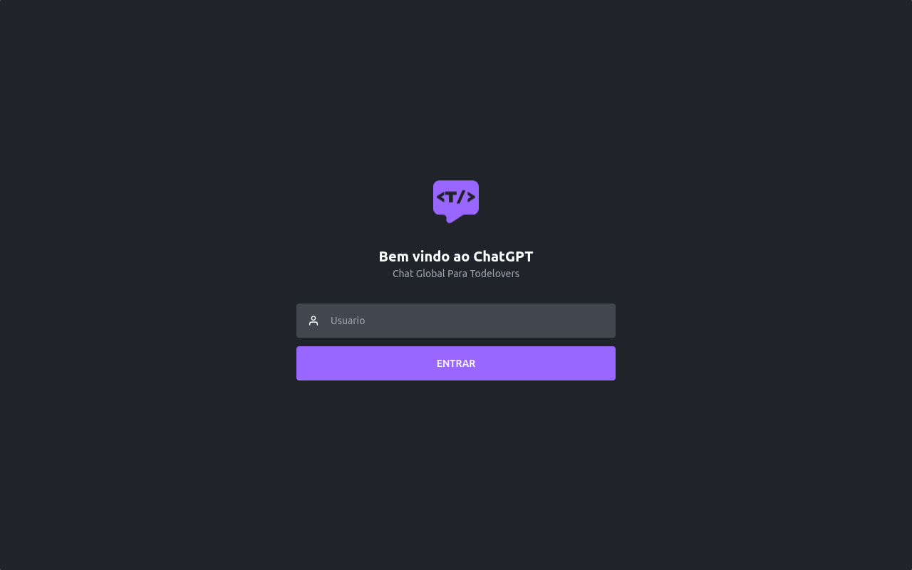
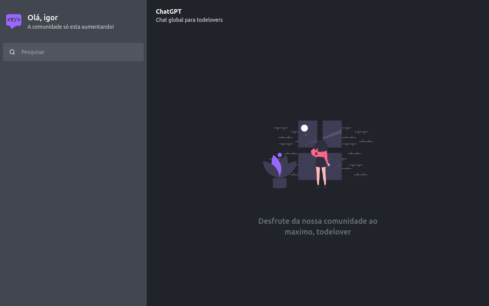
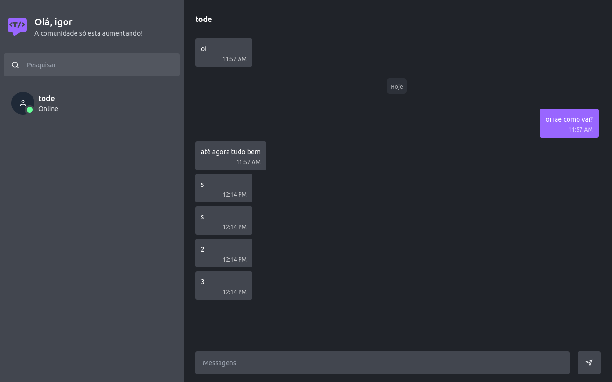

# Chat com Node.js e Socket.IO
Este é o frontend do Chat criado pelo TikToker e Desenvolvedor <a href="https://www.tiktok.com/@todev3">Emerson (Tode)</a>. Durante a live, Emerson demonstrou como criar um sistema de chat utilizando Node.js e Socket.IO. Este frontend foi desenvolvido por mim com Next.js para fornecer uma interface de usuário interativa para o Chat.

---

<details>
  <summary>
    Paginas
  </summary>
  
  
  
</details>

----

### Pré-requisitos
Antes de começar, certifique-se de ter as seguintes ferramentas instaladas:

- Node.js: versão 14 ou superior
- npm: gerenciador de pacotes do Node.j`s (normalmente instalado junto com o Node.js)

### Instalação
Siga estas etapas para configurar e executar o frontend do Chat:

- Clone este repositório para o seu ambiente local:
```bash
git clone https://github.com/franklinST-05/fala-meu-mano.web
```

- Navegue até o diretório do projeto:
```bash
cd fala-meu-mano.web
```
- Instale as dependências do projeto:

```bash
npm install
```

Execute o mesmo passo a passo do lado de <a href="https://github.com/Todev3/fala-meu-mano">server</a>

Execute ambas as aplicações
Abra o navegador e acesse http://localhost:3002 para visualizar o Chat.

### Funcionalidades
- Envio e recebimento de mensagens em tempo real
- Listagem de usuários conectados
- Notificações de entrada e saída de usuários

### Tecnologias utilizadas
- Next.js: framework React para renderização no lado do servidor (SSR) e construção de aplicativos web
- Socket.IO: biblioteca de comunicação em tempo real que permite a troca bidirecional de eventos entre o cliente e o servidor

### Contribuição
Se você quiser contribuir com este projeto, fique à vontade para abrir uma issue ou enviar um pull request. Sua contribuição é muito apreciada!